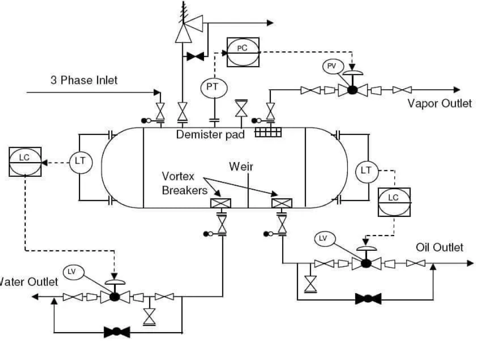
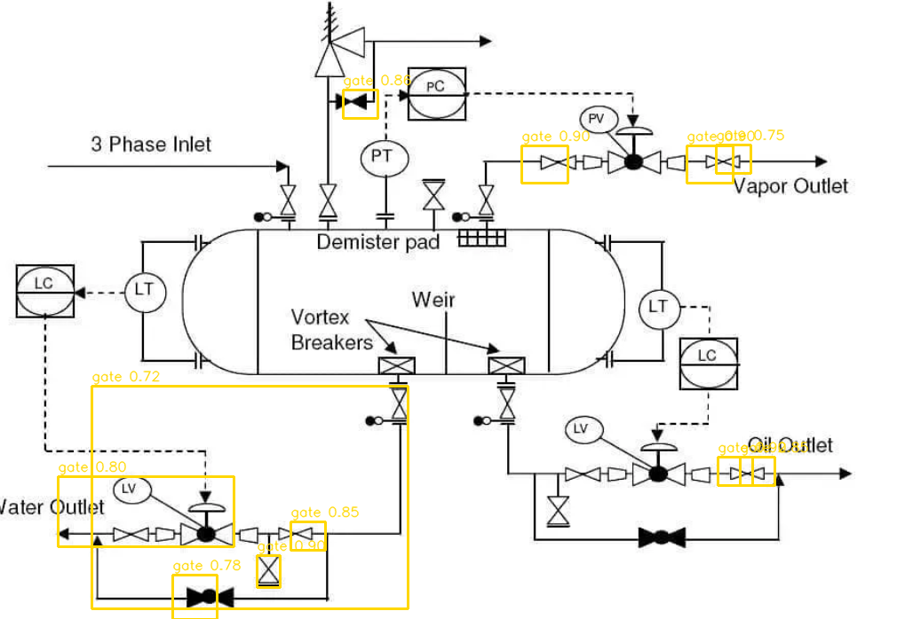

# P&ID Valve Detection & Classification Pipeline

Automatically detect and classify valve symbols in P&ID (Piping & Instrumentation Diagram) schematics using **classical computer vision** for detection and the **OpenAI vision API** for classification — no ML training required.

---

## Demo

### Input schematic


### Annotated output — valves detected and labeled


> **13 valves detected** (11 gate, 2 butterfly) with confidence scores overlaid as colored bounding boxes.

---

## How It Works

```
Input image
    │
    ▼
Stage 1 ── preprocess.py   Grayscale → Otsu threshold → auto-polarity → denoise → deskew
    │
    ▼
Stage 2 ── detect.py       Template matching (scale × angle grid) + Connected components → NMS
    │
    ▼
Stage 3 ── classify.py     Few-shot GPT vision: reference symbols + crop → {label, confidence}
    │
    ▼
Stage 4 ── assemble.py     Filter unknowns & low-confidence → draw boxes → build JSON records
    │
    ▼
  Output:  annotated PNG  +  results JSON
```

**Key design principle — high-recall detection, precision via LLM:**
The detector deliberately over-proposes candidates. False positives are filtered in Stage 3 by the model labelling them `"unknown"`. A missed valve in Stage 2 cannot be recovered later, so recall matters more than precision at the detection stage.

---

## Features

- No YOLO, no trained detection model — pure OpenCV template matching + connected-component analysis
- Few-shot GPT vision classification using reference symbol images as exemplars
- Supports 7 valve types out of the box: **ball, butterfly, three-way, pinch, gate, oil pump, coriolis meter**
- Parallel API calls with exponential-backoff retry
- Debug mode: saves intermediate images at every stage for inspection
- Streamlit web UI for point-and-click usage
- Fully configurable via `config.yaml` — no code changes needed to tune thresholds
- Extensible: add a new valve type by dropping a PNG into `refs/` and adding two lines to config

---

## Tech Stack

| Package | Role |
|---|---|
| Python 3.11+ | Runtime |
| opencv-python ≥ 4.9 | Template matching, connected components, image I/O |
| numpy ≥ 1.26 | Array operations |
| openai ≥ 1.30 | Vision API (GPT-5 / GPT-4o) |
| pillow ≥ 10.3 | Supplementary image I/O |
| python-dotenv ≥ 1.0 | `.env` key loading |
| pyyaml ≥ 6.0 | Config parsing |
| streamlit ≥ 1.35 | Web UI |
| pandas ≥ 2.0 | Results table in UI |

---

## Project Structure

```
tag_classifier_only_with_llm/
└── valve_pipeline/
    ├── refs/                   # Reference valve symbol PNGs (few-shot exemplars)
    │   ├── ball.png
    │   ├── butterfly.png
    │   ├── gate.png
    │   ├── pinch.png
    │   ├── three-way.png
    │   ├── oil-pump.png
    │   └── coriolis-meter.png
    ├── input/                  # Place schematic images here
    ├── output/                 # Annotated PNGs + result JSONs (auto-created)
    │   └── debug/              # Per-stage debug images (--debug flag)
    ├── src/
    │   ├── preprocess.py       # Stage 1 — preprocessing
    │   ├── detect.py           # Stage 2 — candidate detection
    │   ├── classify.py         # Stage 3 — GPT vision classification
    │   ├── assemble.py         # Stage 4 — filtering + annotation
    │   └── pipeline.py         # Orchestrator + CLI entry point
    ├── app.py                  # Streamlit web UI
    ├── config.yaml             # All tunable parameters
    ├── .env                    # OPENAI_API_KEY (fill in your key)
    └── requirements.txt
```

---

## Setup

### 1. Clone & install dependencies

```bash
git clone https://github.com/your-username/tag_classifier_only_with_llm.git
cd tag_classifier_only_with_llm/valve_pipeline
pip install -r requirements.txt
```

### 2. Set your OpenAI API key

Create `valve_pipeline/.env`:

```
OPENAI_API_KEY=sk-...your-key-here...
```

### 3. Verify dependencies

```bash
python -c "import cv2, numpy, openai, PIL, dotenv, yaml; print('All dependencies OK')"
```

```
All dependencies OK
```

---

## CLI Usage

All commands are run from inside the `valve_pipeline/` directory.

### Process a single schematic

```bash
python -m src.pipeline input/diagram.png
```

```
[pipeline] Processing input/diagram.png
[pipeline] Stage 1 done — binary shape: (900, 1200)
[pipeline] Stage 2 done — 47 candidates after NMS
[pipeline] Stage 2b done — 47 valid crops
[classify] 47/47 crops classified
[pipeline] Stage 3 done — 47 classifications
[pipeline] Stage 4 done — 13 valves kept after filtering
[pipeline] Done. 13 valves found.
  Annotated image : output/diagram_annotated.png
  JSON results    : output/diagram_results.json
```

### Process with debug images

```bash
python -m src.pipeline input/diagram.png --debug
```

Saves three additional images to `output/debug/`:

| File | Contents |
|---|---|
| `diagram_preprocessed.png` | Binary thresholded image (white valve linework on black) |
| `diagram_candidates_pre_nms.png` | All raw candidates — red = template match, blue = connected component |
| `diagram_candidates_post_nms.png` | Surviving candidates after non-maximum suppression |

### Batch process all images in `input/`

```bash
python -m src.pipeline --batch
```

```
[pipeline] Processing input/diagram_01.png ...
[pipeline] Done. 8 valves found.

[pipeline] Processing input/diagram_02.png ...
[pipeline] Done. 15 valves found.
```

### Use a custom config file

```bash
python -m src.pipeline input/diagram.png --config custom_config.yaml --debug
```

---

## Streamlit UI

A browser-based UI lets you upload schematics and inspect results without using the terminal.

### Launch

```bash
cd valve_pipeline
streamlit run app.py
```

Then open [http://localhost:8501](http://localhost:8501) in your browser.

### UI features

- **File uploader** — drag-and-drop PNG / JPG / TIF
- **Sidebar sliders** — adjust match threshold, NMS IoU, and confidence floor live
- **API key field** — override the `.env` key for the current session
- **Debug mode toggle** — show intermediate stage images inline
- **Side-by-side view** — input vs. annotated output
- **Detection table** — sortable results with label, confidence, source, bbox
- **Download buttons** — save annotated image or JSON results

---

## Output Format

### Annotated image

Colored bounding boxes drawn over the original schematic, labeled with valve type and confidence:

| Label | Box color |
|---|---|
| gate | Yellow |
| ball | Green |
| butterfly | Blue-orange |
| threeway | Orange |
| pinch | Purple |

### JSON results

```json
{
  "schematic": "input/diagram.png",
  "detections": [
    {
      "bbox": [103, 435, 356, 251],
      "label": "gate",
      "confidence": 0.9,
      "detection_source": "cc",
      "match_score": 1.0
    },
    {
      "bbox": [687, 157, 50, 50],
      "label": "butterfly",
      "confidence": 0.72,
      "detection_source": "template",
      "match_score": 0.49
    }
  ]
}
```

`bbox` is `[x, y, width, height]` in pixels. `detection_source` is either `"template"` (template matching) or `"cc"` (connected component).

Validate with:

```bash
python -m json.tool output/diagram_results.json
```

---

## Reference Symbols

The pipeline ships with 7 reference images used as few-shot exemplars:

| Symbol | File | Label |
|---|---|---|
| Ball valve | `refs/ball.png` | `ball` |
| Butterfly valve | `refs/butterfly.png` | `butterfly` |
| Gate valve | `refs/gate.png` | `gate` |
| Pinch valve | `refs/pinch.png` | `pinch` |
| Three-way valve | `refs/three-way.png` | `threeway` |
| Oil pump | `refs/oil-pump.png` | `oilpump` |
| Coriolis meter | `refs/coriolis-meter.png` | `coriolismeter` |

---

## Adding a New Valve Type

1. **Add reference image** — place a clean PNG of the symbol in `refs/` (e.g., `check.png`)

2. **Register in `config.yaml`**:
   ```yaml
   reference_map:
     check.png: check
   ```

3. **Add to `VALID_LABELS` in `src/classify.py`**:
   ```python
   VALID_LABELS = {"ball", "butterfly", "threeway", "pinch", "gate",
                   "oilpump", "coriolismeter", "check", "unknown"}
   ```

4. **Add a bounding-box color in `src/assemble.py`**:
   ```python
   _LABEL_COLORS = {
       ...
       "check": (0, 255, 255),   # Cyan
   }
   ```

No other changes needed — the pipeline picks up new types automatically.

---

## Configuration Reference

```yaml
# valve_pipeline/config.yaml

model: gpt-5-mini-2025-08-07        # OpenAI model for classification

detection:
  scales: [0.3, 0.4, ..., 1.5]     # Template resize factors
  angles: [0, 45, 90, 135, 180, 225, 270, 315]  # Rotation angles (degrees)
  match_threshold: 0.45             # Template match score cutoff (lower = more proposals)
  nms_iou: 0.3                      # Non-max suppression overlap threshold
  cc_min_area: 80                   # Min connected-component area in pixels
  cc_max_area: 8000                 # Max connected-component area in pixels
  cc_aspect_range: [0.3, 4.0]       # Width/height ratio filter

classify:
  confidence_floor: 0.7             # Drop detections below this confidence
  max_workers: 4                    # Parallel OpenAI API calls

paths:
  refs_dir: refs
  input_dir: input
  output_dir: output
  debug_dir: output/debug

reference_map:
  ball.png: ball
  butterfly.png: butterfly
  three-way.png: threeway
  pinch.png: pinch
  gate.png: gate
  oil-pump.png: oilpump
  coriolis-meter.png: coriolismeter
```

---

## Tuning Guide

### Too many false positives (pipes / text classified as valves)

```yaml
detection:
  match_threshold: 0.55         # raise from 0.45
  cc_aspect_range: [0.4, 3.0]  # tighten from [0.3, 4.0]
  cc_min_area: 150              # raise from 80
classify:
  confidence_floor: 0.8         # raise from 0.7
```

### Too many missed valves (under-detection)

```yaml
detection:
  match_threshold: 0.35         # lower from 0.45
  scales: [0.2, 0.25, 0.3, 0.4, 0.5, ..., 1.5]   # add smaller scales
  cc_aspect_range: [0.2, 6.0]  # widen from [0.3, 4.0]
classify:
  confidence_floor: 0.6         # lower from 0.7
```

### Small input images (thumbnails / screenshots)

```yaml
detection:
  match_threshold: 0.35
  cc_min_area: 30               # lower from 80
  cc_aspect_range: [0.2, 6.0]
```

---

## Model Compatibility Notes

GPT-5 reasoning models have different API constraints from GPT-4o:

| Parameter | GPT-4o | GPT-5 series |
|---|---|---|
| `temperature=0` | Supported | **Not supported** — only default (1) allowed |
| `max_tokens` | Supported | **Not supported** — use `max_completion_tokens` |
| small `max_completion_tokens` | Fine | **Dangerous** — model uses hundreds of internal reasoning tokens before writing output; a tight cap silently returns empty content |

`classify.py` intentionally omits both `temperature` and `max_completion_tokens` to work correctly with all model families.

---

## Verification Checklist

```bash
# 1. Check all imports
python -c "import cv2, numpy, openai, PIL, dotenv, yaml; print('OK')"

# 2. End-to-end run with debug
python -m src.pipeline input/input_54mini.png --debug

# 3. Inspect debug images
#    output/debug/input_54mini_preprocessed.png    — binary image
#    output/debug/input_54mini_candidates_pre_nms.png  — all raw candidates
#    output/debug/input_54mini_candidates_post_nms.png — after NMS

# 4. Validate JSON output
python -m json.tool output/input_54mini_results.json
```

---

## License

MIT
